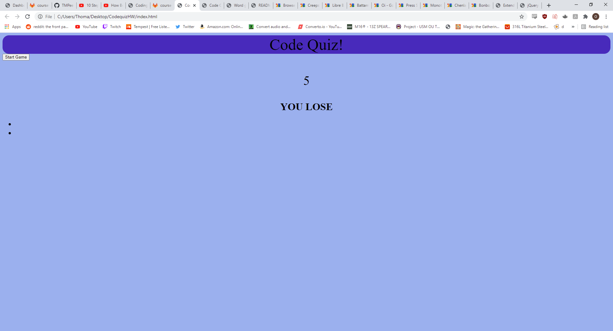

# CodequizHW

The purpose 

## Getting Started

I started a fresh repo and started generating all my files, then I started pseudocoding and taking notes about what functions and steps I needed to take in order to solve the problem. A lot of the functions I thought about were deeper on a conceptual level than I was used to and I had to make a lot of variables in order for the pieces to actually interact with each other as well as thinking about a plan of attack and changing my ideas while coming up with the code to make my ideas operate.

### Prerequisites

In order to accomplish the goal of this assignment, I had to use VSCode for the HTML but particularly JavaScript as well as Gitbash for moving files between my repository and local machine. I also used Github to create the repository that I was sending to. This assignment also called for CSS for styling the elements that I appended and created via javascript in the HTML.

### Solving

I honestly wouldn't even consider this assignment truly solved because there are several features that I intended to create that I either: didn't have enough time to experiment with after so much time was spent on debugging or asking for help with trying to go from pseudocode to actual code, or that I straight up didn't know how to use my current tool/skillset to implement them. Regardless I did the best that I could and the things I thought about are as follows. I thought about my variable declaration and how I could have certain elements of my HTML controlled by my javascript functions, creating an array of questions and deciding to simplify the prompt by creating true or false questions and answers, having a working timer and a method of decrementing the timer based on which question answer was chosen, 

## Technologies Used

* [HTML](https://developer.mozilla.org/en-US/docs/Web/HTML)
* [JS](https://www.javascript.com/)

## Deployed Link

* [https://tmpeeler.github.io/passwordgenHW/](#)

## Code snippet of important work:
Probably my favorite and what I believe to be my most creative "solution" to the criteria of the prompt:
var quizQuestions = [
    {
        question: "Which color is my favorite?",
        choice1: "blue",
        choice2:  "red",
        correctAnswer: "answer1" 
    },
    ----- and -----

function nextQuestion() {
    var questionText = document.querySelector(".quizQuestions");
    questionText.textContent = quizQuestions[questionIndex].question; 

    document.querySelector("#answer1").textContent = quizQuestions[questionIndex].choice1;
    document.querySelector("#answer2").textContent = quizQuestions[questionIndex].choice2;
    
}

using both of these ideas in tandem to actual accomplish part of the assignment felt very satisfying and whether I felt that I did or did not grasp every concept presented with the assignment, I feel that I actually learned a lot about logistical thinking and how to express myself more computationally

## Picture of website currently deployed

;

## Authors

* **Thomas Peeler** 

- [https://github.com/TMPeeler/passwordgenHW]

## Acknowledgments

* Special thanks to Marko and Mark for helping me debug and come up with ways to use my tools to solve the big problems and restrictions of this as well as Javier, Jake, and Liam for telling me about their understanding and strategies of attack that helped me understand what was necessary to solve the problem.